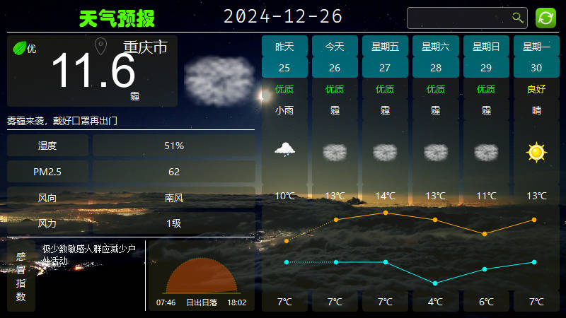

## Qt天气工具项目

### 项目简介

本项目是一个基于Qt框架开发的天气工具，旨在为用户提供一个简单易用的天气查询工具。用户可以通过该工具查询指定城市的天气信息，包括实时天气、未来几天的天气预报、空气质量等。

### 功能特点

- 实时天气查询：用户可以查询指定城市的实时天气信息，包括温度、湿度、风速、风向等。
- 未来几天的天气预报：用户可以查询未来几天的天气预报，包括最高温度、最低温度、天气状况等。

### 示例图

### 使用方法

1. 克隆项目到本地
2. 打开项目文件，使用Qt Creator进行编译和运行
3. 在主界面输入城市名称，点击查询按钮即可获取天气信息（默认城市为重庆）

### 注意事项

- 请确保您的计算机已经安装了Qt Creator和Qt开发环境
- 本项目使用了第三方天气API，请确保您的网络连接正常
- 本项目仅供学习和参考，不得用于商业用途
